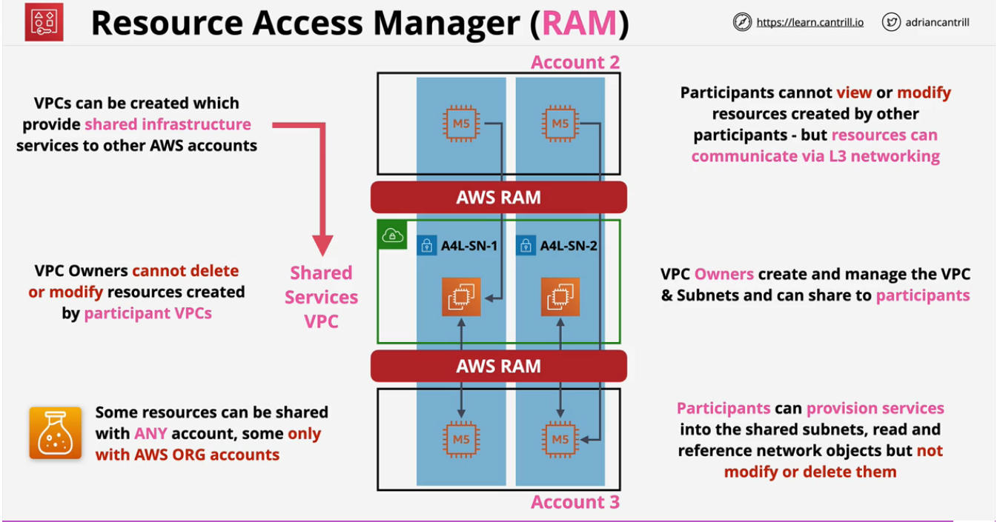

# AWS Solutions Architect - Professional (SAP-C01) - Notes
---

### Security Token Service (STS)
- Generates __Temporary__ Credentials. 
- Similar to access keys but they __EXPIRE__ and do not belong to the identity.
- Limited Access.
- Use to access AWS Resources.
- Requested by an Identity (AWS or External).

### Revoking Temporary Credentials

What will you do if temporary credentials leaked and compromised? 

- You can delete the role but it will impact __ALL__ identity that assume that role. 
- You can change the __TRUST__ policy but it has no impact to the existing credentials that has been generated.
- Changing the __PERMISSIONS__ policy will impact __ALL__ credentials.

**Resolution:**  
Use __Revoke Sessions__ in the role,  this will add an *AWSRevokeOlderSessions* inline policy onto that IAM role which will __DENY__ sessions in a point in time and because of this the credentials that has been generated will be expired and only the identities included in the __trust policy__ can renew the role.

### IAM Permissions Boundary
Use to limit what permissions an identity can receive. 
**NOTE:** They do not grant access.

### Resource Access Manager and Availability Zone IDs

#### Resource Access Manager (RAM)

- Use to **share** AWS resources between AWS accounts.
  - Products need to be supported by RAM.
- This can be shared with Principals (e.g. Accounts, Organization Units or ORG's).
- Shared resources can be accessed natively - as if they are in the same network.
- No charges for using the service - only the underlying services that it leverages.

#### Availability Zone IDs (AZ IDs)
- This are unique **identifiers** for a given Availability Zone.
- AWS rotates physical facilities that are used by Availability Zones and this are not consistent in each AWS account. For example `us-east-1a` in an AWS account is not the same as other AWS account `us-east-1a`.
    - This may cause issue when sharing resources to other AWS account.
 - To resolve this, AWS used **AZ IDs** as an identifier for a specific Availability Zone and this is utilize by AWS RAM.

#### AWS RAM and AZ IDs side by side
- Owner account creates a share. Utilizes AZ IDs to identify on which resources will be shared.
    - Owner will retain full ownership of the resources. 
- Defines a principal to whom to share.
    - **IF** participant is inside an AWS Organization with Sharing **enabled**, resouces will be automatically shared.
    - **IF** participant is **NOT** inside an AWS Organization OR AWS Organization Sharing is **disabled**, principal need to accept the invite.

**NOTES:**
- Shared resouces using AWS RAM cannot be modified or deleted by the account to whom you shared your resources.
    - Shared principals can interact with the resources but cannot edit or modify them.
- AWS Resources that has been created by the owner account or each member account are cannot be seen by other accounts except to the account where they are created.

 

    